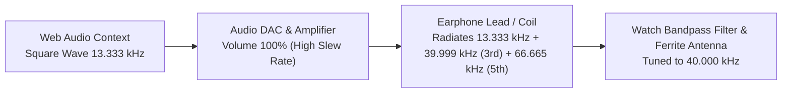
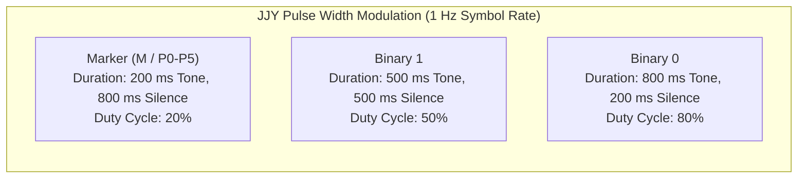
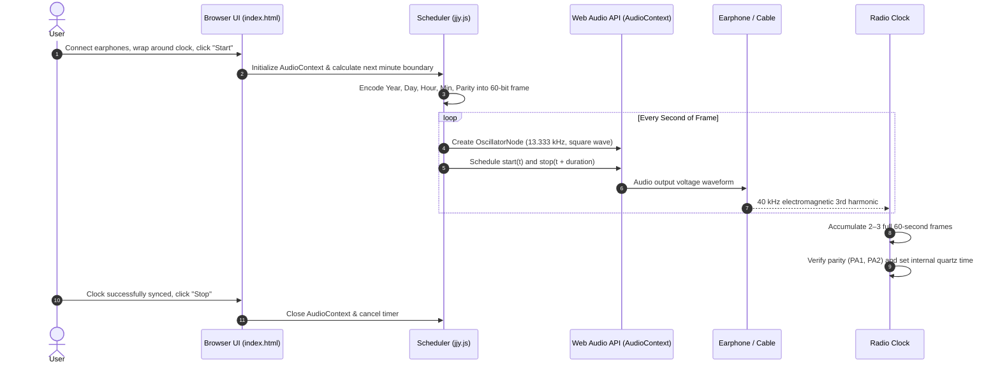
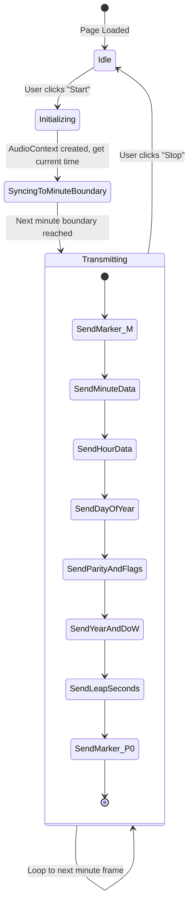

# 9M2PJU WebTimeSignal

> **Browser-based Low Frequency (LF) Time Signal Generator & JJY Radio Clock Transmitter**

WebTimeSignal is an open-source web application that transmits radio time signals directly from any modern web browser using standard headphones or audio cables. It enables radio-controlled clocks and watches (電波時計 / Wave Ceptor / Multi-Band timepieces) to synchronize accurately indoors or in regions outside normal terrestrial broadcast coverage.

---

## Table of Contents

1. [Overview & Operating Principle](#overview--operating-principle)
2. [Physics of Harmonic Transmission](#physics-of-harmonic-transmission)
3. [JJY Protocol & Frame Specification](#jjy-protocol--frame-specification)
4. [System Architecture & Signal Flow](#system-architecture--signal-flow)
5. [Usage Instructions](#usage-instructions)
6. [Hardware & Placement Recommendations](#hardware--placement-recommendations)
7. [Current Codebase Architecture](#current-codebase-architecture)
8. [Roadmap & Planned Enhancements](#roadmap--planned-enhancements)
9. [Safety & Hearing Protection](#safety--hearing-protection)
10. [License & Acknowledgments](#license--acknowledgments)

---

## Overview & Operating Principle

Terrestrial time signal stations broadcast standard time and frequency signals over longwave radio frequencies:
* **JJY (Japan)**: 40 kHz (Fukushima - Mount Otakadoya) and 60 kHz (Saga - Mount Hagane)
* **WWVB (USA)**: 60 kHz (Fort Collins, Colorado)
* **MSF (UK)**: 60 kHz (Anthorn, Cumbria)
* **DCF77 (Germany)**: 77.5 kHz (Mainflingen)
* **BPC (China)**: 68.5 kHz (Shangqiu, Henan)

Inside reinforced concrete buildings or outside the transmitter footprint, radio-controlled clocks cannot receive the broadcast signal. **WebTimeSignal** uses standard consumer audio hardware to generate an electromagnetic field that replicates the exact time signal encoding.

```
+------------------+       +-------------------+       +-----------------------+
|  Host Device     |  Web  |  Headphone Cable  |  EM   |  Radio-Controlled     |
|  (PC / Phone)    | Audio |  (Improvised      | Field |  Clock / Watch        |
|  WebTimeSignal   |======>|   Coil Antenna)   | ~~~~> |  (Ferrite Rod Antenna)|
+------------------+       +-------------------+       +-----------------------+
```

---

## Physics of Harmonic Transmission

Consumer audio digital-to-analog converters (DACs) operate at standard sampling rates of 44.1 kHz or 48 kHz, imposing a Nyquist frequency limit of 22.05 kHz or 24 kHz. As a result, standard audio outputs cannot directly synthesize a clean 40 kHz or 60 kHz sine wave fundamental.

To overcome this hardware limitation, WebTimeSignal exploits **odd harmonic radiation** from high-amplitude square waves.

### Mathematical Formulation

A square wave of fundamental frequency $f_0$ consists of an infinite series of odd harmonics:

$$\text{x}(t) = \frac{4}{\pi} \sum_{k=1,3,5,\dots}^{\infty} \frac{1}{k} \sin(2\pi k f_0 t) = \frac{4}{\pi} \left( \sin(2\pi f_0 t) + \frac{1}{3}\sin(6\pi f_0 t) + \frac{1}{5}\sin(10\pi f_0 t) + \dots \right)$$

For the **40 kHz JJY standard**:
* **Fundamental audio frequency ($f_0$)**: $13.333\text{ kHz}$
* **3rd Harmonic ($3 \times f_0$)**: $3 \times 13.333\text{ kHz} = 39.999\text{ kHz} \approx 40.000\text{ kHz}$



When audio output volume is set to maximum, current flowing through the voice coil and earphone cabling radiates magnetic flux. The internal tuned ferrite core antenna of the radio clock rejects the fundamental $13.333\text{ kHz}$ tone and captures the $40\text{ kHz}$ 3rd harmonic.

---

## JJY Protocol & Frame Specification

The JJY time code is broadcast in a continuous 60-second frame modulated with **Pulse Width Modulation (PWM)** at 1 pulse per second.

### Pulse Width Definitions



### 60-Second JJY Frame Structure

| Second | Field | Encoding / Description |
|:---:|:---|:---|
| **00** | **M** | Minute Reference Marker (200 ms pulse) |
| **01 – 08** | **Minute (00–59)** | BCD: 40, 20, 10 (tens) + 8, 4, 2, 1 (units) |
| **09** | **P1** | Position Marker 1 (200 ms pulse) |
| **10 – 18** | **Hour (00–23)** | BCD: 20, 10 (tens) + 8, 4, 2, 1 (units) |
| **19** | **P2** | Position Marker 2 (200 ms pulse) |
| **20 – 28** | **Day of Year (High/Mid)** | BCD Day count from Jan 1: 200, 100 + 80, 40, 20, 10 |
| **29** | **P3** | Position Marker 3 (200 ms pulse) |
| **30 – 33** | **Day of Year (Low)** | BCD Day count: 8, 4, 2, 1 |
| **34 – 35** | **Reserved** | Fixed to binary 0 (`00`) |
| **36** | **PA1** | Parity for Hour (even parity across hour bits) |
| **37** | **PA2** | Parity for Minute (even parity across minute bits) |
| **38** | **SU1** | Summer Time / Daylight Saving indicator 1 |
| **39** | **P4** | Position Marker 4 (200 ms pulse) |
| **40** | **SU2** | Summer Time / Daylight Saving indicator 2 |
| **41 – 48** | **Year (00–99)** | BCD: 80, 40, 20, 10 (tens) + 8, 4, 2, 1 (units) |
| **49** | **P5** | Position Marker 5 (200 ms pulse) |
| **50 – 52** | **Day of Week (0–6)** | Binary: Sunday=0, Monday=1, ..., Saturday=6 |
| **53 – 54** | **Leap Second (LS1, LS2)** | `00` = No leap second, `11` = Positive leap second (+1s) |
| **55 – 58** | **Reserved** | Fixed to binary 0 (`0000`) |
| **59** | **P0** | Position Marker 0 (200 ms pulse) |

---

## System Architecture & Signal Flow

### Transmission Lifecycle



### State Machine



---

## Usage Instructions

### Prerequisites
1. **Audio Device**: Computer, tablet, or smartphone with a 3.5mm headphone jack or USB-C / Lightning audio adapter.
2. **Earphones or Wire**: Standard wired earphones, headphones, or a 3.5mm aux cable.
3. **Radio Clock**: Any JJY-compatible radio-controlled timepiece (Citizen, Casio, Seiko, Rhythm, etc.).

### Step-by-Step Procedure

1. **Host Clock Accuracy**:
   Ensure the host computer or smartphone's clock is synchronized via NTP (Internet Time).
2. **Connect Earphones**:
   Plug your wired earphones into the device's audio jack.
3. **Wrap the Cable**:
   Wrap the earphone cable 2 to 4 times around the clock housing near its internal receiver antenna (usually located near the 12 o'clock position on wristwatches or along the top edge of desk clocks).
4. **Set Volume to Maximum**:
   Set the device master volume to **100%**.
5. **Start Transmission**:
   Click the **"Start"** button on the WebTimeSignal page. The canvas visualizer will illuminate green/yellow/red indicators for each transmitted second.
6. **Trigger Manual Reception on Clock**:
   Press and hold the manual receive button (usually labeled `REC`, `WAVE`, or `SET`) on your radio clock for 2–3 seconds until the sync icon blinks.
7. **Wait for Synchronization**:
   Keep the setup still for **2 to 5 minutes** (most clocks require 2 to 3 consecutive clean 60-second frames to validate time data). Once synchronized, click **"Stop"**.

---

## Hardware & Placement Recommendations

```
           +----------------------------------+
           |       Radio-Controlled Clock     |
           |      +--------------------+      |
           |      |   12:34:56  [RC]   |      |
           |      +--------------------+      |
           +----------------------------------+
             |    |     |    |     |    |
             |    |     |    |     |    |   <-- 2 to 4 loops of
             +----+-----+----+-----+----+       earphone cable
                  |                |
                  +--------+-------+
                           |
                     [3.5mm Jack]
                           |
                 +-------------------+
                 | Host Audio Output |
                 +-------------------+
```

* **Inductive Coupling**: Wrapping the earphone cord creates an air-core inductive coil. The magnetic field strength increases proportionally with the number of turns:
  $$B \propto N \cdot I$$
  where $N$ is the number of wire loops and $I$ is the audio output current.
* **Orientation**: Align the loops parallel to the internal ferrite bar inside the clock for maximum magnetic flux linkage.

---

## Codebase Architecture

The project is structured into clean, modular ES6 components:

```
9M2PJU-WebTimeSignal/
├── index.html                   # Modern responsive interface with multi-language & theme support
├── manifest.webmanifest         # Progressive Web App (PWA) manifest
├── sw.js                        # Service Worker for 100% offline operation
├── css/
│   └── app.css                  # Responsive design, Dark/Light theme, bitstream inspector styling
├── js/
│   ├── app.js                   # Application bootstrap and UI controller
│   ├── i18n.js                  # Internationalization (English, Bahasa Melayu, 日本語)
│   ├── audio-engine.js          # Web Audio engine with Anti-Phase Differential Drive & Lookahead
│   ├── ntp-sync.js              # Network Time Protocol (NTP) offset synchronization
│   ├── worker-timer.js          # Background Web Worker heartbeat timer
│   └── encoders/
│       ├── base-encoder.js      # Common BCD conversion, Day-of-Year, and parity calculations
│       ├── jjy.js               # JJY 40 kHz & 60 kHz encoder (Japan)
│       ├── wwvb.js              # WWVB 60 kHz encoder (USA / NIST)
│       ├── dcf77.js             # DCF77 77.5 kHz encoder (Germany / PTB)
│       ├── msf.js               # MSF 60 kHz encoder (UK / Anthorn)
│       └── bpc.js               # BPC 68.5 kHz encoder (China / Shangqiu)
├── tests/
│   ├── index.html               # In-browser visual unit test runner
│   ├── test-suite.js            # Comprehensive test suite covering all encoders and parity logic
│   └── run-node-tests.js        # Node.js CLI test runner
├── icons/
│   └── icon.svg                 # Scalable vector application icon
├── package.json                 # Project metadata & npm test script
├── README.md                    # Comprehensive documentation and technical specifications
└── LICENSE.md                   # MIT License
```

---

## Implemented Enhancements Matrix

| Area | Feature | Implementation Details | Status |
|---|---|---|:---:|
| **Standards** | **Multi-Standard Support** | JJY 40 kHz, JJY 60 kHz, WWVB 60 kHz, DCF77 77.5 kHz, MSF 60 kHz, BPC 68.5 kHz | **Implemented** |
| **Clock Source** | **Web NTP Sync** | Atomic internet time synchronization with RTT latency compensation and drift calculation | **Implemented** |
| **Clock Source** | **Custom Override** | Manual date/time and timezone selector for arbitrary test signals | **Implemented** |
| **RF Induction** | **Anti-Phase Stereo Drive** | $180^\circ$ phase-inverted Right channel doubling peak-to-peak coil voltage ($+6\text{ dB}$) | **Implemented** |
| **RF Induction** | **WaveShaper Overdrive** | Sharp non-linear sigmoid clipping generating rich odd harmonics ($3f, 5f, \dots$) | **Implemented** |
| **Audio Timing** | **Lookahead Scheduler** | Background Web Worker heartbeat driving sample-accurate Web Audio lookahead | **Implemented** |
| **Platform** | **PWA & Offline** | Service Worker asset caching for field use with zero internet dependency | **Implemented** |
| **UI / UX** | **i18n Multi-Language** | Full native support for English, Bahasa Melayu (proper Malay), and 日本語 (Japanese) | **Implemented** |
| **UI / UX** | **Dark / Light Theme** | High-contrast visualizer with real-time frame inspector and oscilloscope | **Implemented** |
| **Testing** | **Automated Test Suite** | 11 unit tests covering all protocols, BCD algorithms, and parity calculations | **Implemented** |

---

## Safety & Hearing Protection

> [!CAUTION]
> **DO NOT WEAR EARPHONES IN OR NEAR YOUR EARS WHILE RUNNING THIS APPLICATION.**
> 
> This tool outputs high-amplitude, high-frequency square waves ($13.333\text{ kHz}$) at maximum volume ($100\%$). Listening to this audio directly through headphones or earbuds can cause **permanent hearing damage, acoustic trauma, or severe discomfort**. Keep earphones placed near the clock, away from ears and pets.

---

## License & Acknowledgments

* Distributed under the **MIT License**. See [LICENSE.md](file:///home/x/9M2PJU-WebTimeSignal/LICENSE.md) for details.
* Maintained by [9M2PJU](https://github.com/9M2PJU).
* Based on the original implementation by [shogo82148/web-jjy](https://github.com/shogo82148/web-jjy).
