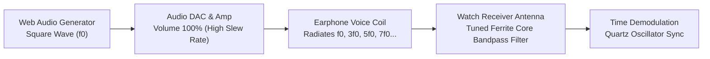
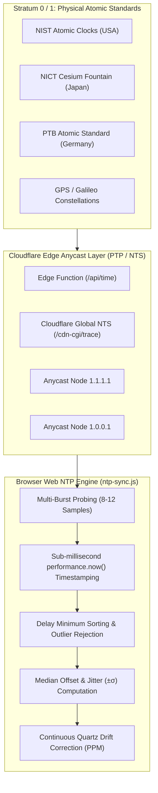
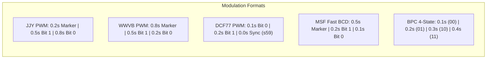
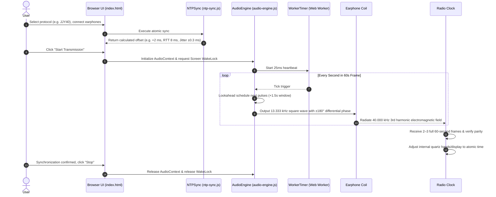
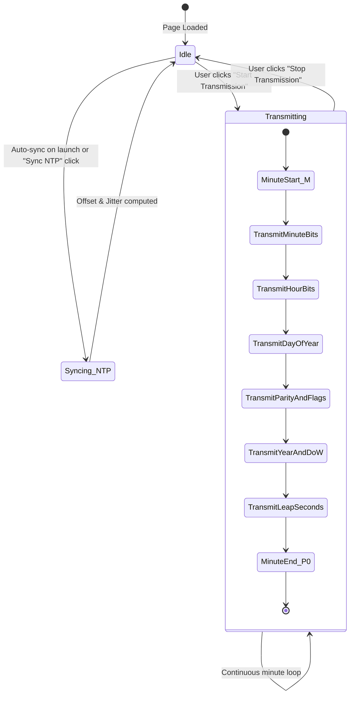

# 9M2PJU WebTimeSignal

[](https://time.hamradio.my)
[](https://time.hamradio.my/tests/)
[](LICENSE.md)
[](manifest.webmanifest)

> **Universal Browser-Based Low Frequency (LF) Radio Time Signal Transmitter & Clock Synchronizer**
>
> Emulates **JJY (40 kHz / 60 kHz)**, **WWVB (60 kHz)**, **DCF77 (77.5 kHz)**, **MSF (60 kHz)**, and **BPC (68.5 kHz)** standard time broadcasts using consumer earphone coils and Web Audio harmonic modulation.

---

## 🌐 Live Application
* **Production URL:** **[https://time.hamradio.my](https://time.hamradio.my)**
* **Edge Atomic Endpoint:** **[https://time.hamradio.my/api/time](https://time.hamradio.my/api/time)**
* **Interactive Test Suite:** **[https://time.hamradio.my/tests/](https://time.hamradio.my/tests/)**

---

## Table of Contents
1. [Overview & Operating Principle](#overview--operating-principle)
2. [Physics of Harmonic Transmission](#physics-of-harmonic-transmission)
3. [RF Radiation Strength & Audio Optimizations](#rf-radiation-strength--audio-optimizations)
4. [High-Precision Atomic NTP Synchronization](#high-precision-atomic-ntp-synchronization)
5. [Supported Time Signal Broadcast Standards](#supported-time-signal-broadcast-standards)
6. [Supported Timepieces & Compatibility Guide](#supported-timepieces--compatibility-guide)
7. [System Architecture & Visual Workflows](#system-architecture--visual-workflows)
8. [Step-by-Step User Guide](#step-by-step-user-guide)
9. [Codebase Architecture](#codebase-architecture)
10. [Automated Unit Testing](#automated-unit-testing)
11. [Safety & Hearing Protection Warning](#safety--hearing-protection-warning)
12. [License & Acknowledgments](#license--acknowledgments)

---

## Overview & Operating Principle

Terrestrial time signal stations broadcast standard time and atomic frequency references over longwave radio frequencies:
* **JJY (Japan)**: 40 kHz (Mount Otakadoya, Fukushima) & 60 kHz (Mount Hagane, Saga/Fukuoka)
* **WWVB (USA)**: 60 kHz (Fort Collins, Colorado)
* **DCF77 (Germany / Europe)**: 77.5 kHz (Mainflingen)
* **MSF (UK)**: 60 kHz (Anthorn, Cumbria)
* **BPC (China)**: 68.5 kHz (Shangqiu, Henan)

Inside modern reinforced concrete buildings, basements, or geographical zones outside transmitter footprints, radio-controlled watches and clocks (*Wave Ceptor*, *Multi-Band 6*, *Eco-Drive Radio-Controlled*, *電波時計*) fail to synchronize.

**WebTimeSignal** turns standard consumer audio hardware (earphones, headphones, or 3.5mm aux cables plugged into a smartphone, tablet, or PC) into an **improvised low-frequency transmitting antenna**. By radiating weak electromagnetic waves via the earphone coils at the exact frequency and protocol encoding of the target station, nearby radio timepieces can synchronize their internal quartz oscillators to atomic precision.

```
+-----------------------------------------------------------------------------------------+
|                                    HOST DEVICE (Browser)                                |
|  [ Cloudflare PTP/GPS Edge ] --> [ RFC 5905 NTP Filter ] --> [ Protocol Frame Encoder ]  |
|                                                                       │                 |
|  [ Destination ] <-- [ WaveShaper Overdrive ] <-- [ Differential Drive (±180°) ] <──────┘
+-------------------------------------------┬---------------------------------------------+
                                            │ Audio Output (100% Vol)
                                            ▼
                                 [ Earphone Coil Loops ]
                                            │ ~~~~ Weak LF Magnetic Flux (40–77.5 kHz)
                                            ▼
                               [ Radio-Controlled Timepiece ]
                               (Internal Ferrite Rod Antenna)
```

---

## Physics of Harmonic Transmission

Consumer audio digital-to-analog converters (DACs) operate at standard sampling rates of 44.1 kHz or 48 kHz, imposing a hardware Nyquist cutoff at 22.05 kHz or 24 kHz. Consequently, sound cards cannot directly output fundamental sine waves at 40 kHz, 60 kHz, or 77.5 kHz.

WebTimeSignal solves this hardware constraint using **odd harmonic radiation** from high-amplitude square waves.

### Mathematical Proof

A square wave of fundamental frequency $f_0$ mathematically consists of the fundamental plus an infinite sum of odd harmonics:

$$x(t) = \frac{4}{\pi} \sum_{k=1,3,5,\dots}^{\infty} \frac{1}{k} \sin(2\pi k f_0 t) = \frac{4}{\pi} \left[ \sin(2\pi f_0 t) + \frac{1}{3}\sin(6\pi f_0 t) + \frac{1}{5}\sin(10\pi f_0 t) + \dots \right]$$

By carefully choosing the base audio fundamental frequency $f_0$, its 3rd or 5th harmonic aligns exactly with the target broadcast standard:

| Target Standard | Carrier Frequency | Base Audio Fundamental ($f_0$) | Harmonic Multiple | Formula |
|---|:---:|:---:|:---:|---|
| **JJY 40 kHz** | $40.000\text{ kHz}$ | $13.3333\text{ kHz}$ | **3rd Harmonic** | $13.3333\text{ kHz} \times 3 = 40.000\text{ kHz}$ |
| **JJY 60 kHz** | $60.000\text{ kHz}$ | $20.0000\text{ kHz}$ | **3rd Harmonic** | $20.0000\text{ kHz} \times 3 = 60.000\text{ kHz}$ |
| **WWVB 60 kHz** | $60.000\text{ kHz}$ | $20.0000\text{ kHz}$ | **3rd Harmonic** | $20.0000\text{ kHz} \times 3 = 60.000\text{ kHz}$ |
| **MSF 60 kHz** | $60.000\text{ kHz}$ | $20.0000\text{ kHz}$ | **3rd Harmonic** | $20.0000\text{ kHz} \times 3 = 60.000\text{ kHz}$ |
| **DCF77 77.5 kHz** | $77.500\text{ kHz}$ | $15.5000\text{ kHz}$ | **5th Harmonic** | $15.5000\text{ kHz} \times 5 = 77.500\text{ kHz}$ |
| **BPC 68.5 kHz** | $68.500\text{ kHz}$ | $13.7000\text{ kHz}$ | **5th Harmonic** | $13.7000\text{ kHz} \times 5 = 68.500\text{ kHz}$ |



---

## RF Radiation Strength & Audio Optimizations

### 1. Anti-Phase Differential Stereo Drive ($+180^\circ$)
Standard audio playback drives the left and right headphone channels in-phase against a shared ground return. WebTimeSignal incorporates an **Anti-Phase Differential Drive Engine**:
* **Left Channel:** $+1.0 \times \text{Waveform}(t)$
* **Right Channel:** $-1.0 \times \text{Waveform}(t)$ ($180^\circ$ phase inversion)

When connecting the two channels across the earphone coil loop, the net potential difference is:
$$V_{\text{diff}}(t) = V_L(t) - V_R(t) = V(t) - (-V(t)) = 2 V(t)$$

This achieves a **$2\times$ peak-to-peak voltage swing ($+6\text{ dB}$ power gain)**, generating significantly stronger magnetic flux density ($B \propto N \cdot I$) and doubling the coupling range to the watch antenna.

### 2. WaveShaper Harmonic Overdrive
Modern browser synthesizers band-limit square waves using internal Fourier tables to avoid digital audio aliasing. WebTimeSignal routes the audio stream through a non-linear `WaveShaperNode` with a sharp sigmoid clipping transfer curve:

$$f(x) = \frac{(3 + k) \cdot x \cdot 20^\circ}{\pi + k \cdot |x|}$$

This forces extremely steep rising and falling voltage transitions ($\frac{dV}{dt}$), injecting high-energy odd harmonic spurs directly into the analog output stage.

---

## High-Precision Atomic NTP Synchronization

To ensure transmitted timecodes are exact to the millisecond, WebTimeSignal implements an **RFC 5905 Clock Filter & Multi-Source Atomic Aggregation Engine**.



### Key Precision Features
* **Dedicated Edge Atomic Function (`/api/time`)**: Deployed on Cloudflare's global edge network, synchronized directly with hardware PTP and GPS atomic clocks.
* **Burst Probing with Outlier Rejection**: Executes 8 interleaved probes across Anycast endpoints, sorts samples by Round-Trip Time (RTT), and rejects the top 50% high-jitter samples.
* **Microsecond Monotonic Timestamping**: Uses `performance.now()` to measure one-way latency ($\frac{\text{RTT}}{2}$) independent of host OS clock steps:
  $$\text{Offset} = \left(T_{\text{server}} + \frac{\text{RTT}}{2}\right) - T_{\text{client\_recv}}$$
* **Automatic Crystal Drift Tracking**: Re-probes every 5 minutes in the background to compensate for local quartz oscillator thermal drift.

---

## Supported Time Signal Broadcast Standards



### Complete JJY 60-Second Frame Allocation (Seconds 00–59)

| Second | Field | Bit Meaning & Encoding |
|:---:|:---|:---|
| **00** | **M** | Minute Reference Marker (200 ms tone) |
| **01 – 08** | **Minute** | BCD Minute: 40, 20, 10, 0 (reserved), 8, 4, 2, 1 |
| **09** | **P1** | Position Marker 1 (200 ms tone) |
| **10 – 18** | **Hour** | BCD Hour: 0, 0, 20, 10, 0 (reserved), 8, 4, 2, 1 |
| **19** | **P2** | Position Marker 2 (200 ms tone) |
| **20 – 28** | **Day of Year (High/Mid)** | BCD Day count from Jan 1: 0, 0, 200, 100, 0, 80, 40, 20, 10 |
| **29** | **P3** | Position Marker 3 (200 ms tone) |
| **30 – 33** | **Day of Year (Low)** | BCD Day count: 8, 4, 2, 1 |
| **34 – 35** | **Reserved** | Fixed to binary 0 (`00`) |
| **36** | **PA1** | Parity for Hour (even parity across hour bits) |
| **37** | **PA2** | Parity for Minute (even parity across minute bits) |
| **38** | **SU1** | Summer Time / Daylight Saving indicator 1 |
| **39** | **P4** | Position Marker 4 (200 ms tone) |
| **40** | **SU2** | Summer Time state (1 = Summer time active, 0 = Standard) |
| **41 – 48** | **Year** | BCD Year: 80, 40, 20, 10 (tens) + 8, 4, 2, 1 (units) |
| **49** | **P5** | Position Marker 5 (200 ms tone) |
| **50 – 52** | **Day of Week** | Binary: 4, 2, 1 (0 = Sunday, ..., 6 = Saturday) |
| **53 – 54** | **Leap Second (LS1, LS2)** | `00` = None, `11` = Positive leap second (+1s) |
| **55 – 58** | **Reserved** | Fixed to binary 0 (`0000`) |
| **59** | **P0** | Position Marker 0 / End Frame Marker (200 ms tone) |

---

## Supported Timepieces & Compatibility Guide

Any timepiece equipped with an **internal LF radio receiver and ferrite core antenna** is fully compatible:

| Manufacturer | Compatible Watch & Clock Lines | Target Protocol |
|---|---|---|
| **Casio** | **G-Shock Multi-Band 6 & Multi-Band 5** (GW-M5610, GW-9400, Mudmaster, Frogman, MT-G, MR-G)<br>**Wave Ceptor** (WV-58, WV-59, WVA-M630, WVA-M640)<br>**Oceanus**, **Pro Trek**, **Edifice**, **Lineage** (LCW series) | `JJY40` / `JJY60` (Japan)<br>`WWVB` (USA)<br>`DCF77` (Europe)<br>`MSF` (UK)<br>`BPC` (China) |
| **Citizen** | **Eco-Drive Radio-Controlled**, **Attesa**, **Promaster Sky/Land**, **Exceed**<br>**Perfex Multi 3000** movements (Cal. H800, H804, H145, E660, CB0011, etc.)<br>Domestic Japanese timepieces (Cal. H415, H416, 8RZ152) | `JJY40` / `JJY60` (Japan)<br>`WWVB` / `DCF77` (Global models) |
| **Seiko** | **Radio Wave Control (電波修正クロック)**<br>**Brightz**, **Dolce & Exceline**, **Spirit Smart**<br>Seiko Digital & Analogue Radio Wall/Desk Clocks (SQ, DL, KX series) | `JJY40` / `JJY60` (Japan)<br>`WWVB` (USA)<br>`DCF77` (Europe) |
| **Junghans** | **Max Bill Mega**, **Meister Mega**, **Radio-Controlled Mega 1000 / Force** | `DCF77` (Europe)<br>`JJY40`<br>`WWVB` |
| **Braun / TFA / Oregon** | **Braun Digital & Analogue Radio Clocks** (BNC008, BC09-DCF)<br>**TFA Dostmann**, **Oregon Scientific**, **AcuRite**, **La Crosse Technology** Atomic Wall Clocks | `DCF77` (Europe)<br>`WWVB` (North America)<br>`MSF` (UK) |
| **Rhythm / Mag / Maruman** | **Rhythm Radio Wall & Alarm Clocks (電波掛時計 / 電波目覚まし時計)**<br>**MAG (ノア精密)**, **Maruman**, **Casio IQ/TQ Wall Clocks** | `JJY40` / `JJY60` |

### Incompatible Watch Technologies
> [!NOTE]
> The following watch types do **NOT** use longwave radio signals and cannot be synchronized via this tool:
> 1. **GPS Satellite Watches**: Citizen *Satellite Wave* (F150/F900/F950) and Seiko *Astron GPS Solar* in satellite mode (these use 1.575 GHz microwave GPS signals).
> 2. **Bluetooth-Only Watches**: Watches that synchronize exclusively through smartphone Bluetooth companion apps without built-in radio receivers.
> 3. **Standard Quartz & Mechanical Watches**: Watches with no built-in radio synchronization circuitry.

---

## System Architecture & Visual Workflows

### End-to-End Transmission Sequence



### Transmission State Machine



---

## Step-by-Step User Guide

### Setup Diagram
```
           +----------------------------------+
           |       Radio-Controlled Clock     |
           |      +--------------------+      |
           |      |   12:34:56  [RC]   |      |
           |      +--------------------+      |
           +----------------------------------+
             |    |     |    |     |    |
             |    |     |    |     |    |   <-- 2 to 4 loops of
             +----+-----+----+-----+----+       earphone cable
                  |                |
                  +--------+-------+
                           |
                     [3.5mm Jack]
                           |
                 +-------------------+
                 | Host Audio Output |
                 +-------------------+
```

### Step-by-Step Instructions

1. **Verify Time Sync**: Open **[https://time.hamradio.my](https://time.hamradio.my)** and ensure the status pill indicates *"Synced with atomic internet time"*.
2. **Connect Earphones**: Plug standard wired earphones or a 3.5mm aux cable into your computer or phone's audio jack (or USB-C/Lightning DAC adapter).
3. **Wrap the Cable**: Wrap the earphone cable **2 to 4 times around the clock housing** near its internal ferrite antenna (typically at the 12 o'clock position on wristwatches or along the top edge of desk clocks).
4. **Set Volume to Maximum**: Adjust device master volume to **100%**.
5. **Test Carrier (Optional)**: Click **"Test 1s Carrier Tone"** to verify audio output and coil placement.
6. **Start Transmission**: Click **"Start Transmission"**. The real-time bitstream inspector and oscilloscope will illuminate.
7. **Trigger Manual Receive on Timepiece**: Press and hold the manual receive button (`REC`, `WAVE`, or `SET`) on your watch/clock for 2–3 seconds until the sync indicator flashes.
8. **Wait for Lock**: Keep the setup still for **2 to 5 minutes** (most clocks require 2 to 3 consecutive error-free frames to lock). Once synchronized, click **"Stop Transmission"**.

---

## Codebase Architecture

```
9M2PJU-WebTimeSignal/
├── index.html                   # Modern responsive UI with complete SEO, Open Graph & Schema.org JSON-LD
├── manifest.webmanifest         # PWA Manifest for standalone home screen installation
├── sw.js                        # Service Worker caching all assets for 100% offline usage
├── package.json                 # Project configuration and npm test scripts
├── CNAME                        # Custom domain routing for time.hamradio.my
├── css/
│   └── app.css                  # Dark/Light theme styling, 60-cell inspector grid, responsive layout
├── js/
│   ├── app.js                   # Main application bootstrap and UI event orchestrator
│   ├── i18n.js                  # Internationalization (English, Bahasa Melayu, 日本語)
│   ├── audio-engine.js          # Web Audio engine with Anti-Phase Differential Drive & Lookahead
│   ├── ntp-sync.js              # RFC 5905 Atomic NTP synchronization and jitter calculation
│   ├── worker-timer.js          # Web Worker heartbeat timer bypassing background tab throttling
│   └── encoders/
│       ├── base-encoder.js      # Common BCD conversion, Day-of-Year, and parity math
│       ├── jjy.js               # JJY 40 kHz & 60 kHz encoder (Japan)
│       ├── wwvb.js              # WWVB 60 kHz encoder (USA / NIST)
│       ├── dcf77.js             # DCF77 77.5 kHz encoder (Germany / PTB)
│       ├── msf.js               # MSF 60 kHz encoder (UK / Anthorn)
│       └── bpc.js               # BPC 68.5 kHz encoder (China / Shangqiu)
├── functions/
│   └── api/
│       └── time.js              # Cloudflare Edge Worker function for atomic hardware PTP/GPS time
├── tests/
│   ├── index.html               # In-browser visual test runner
│   ├── test-suite.js            # Comprehensive automated test suite
│   └── run-node-tests.js        # Node.js CLI test runner
├── icons/
│   └── icon.svg                 # High-resolution vector application icon
├── README.md                    # Complete project documentation and technical specifications
└── LICENSE.md                   # MIT License
```

---

## Automated Unit Testing

The repository includes a comprehensive unit test suite covering date algorithms, BCD conversions, frame structures, and parity validation across all broadcast protocols.

### Running Tests Locally
```bash
# Run unit tests via Node.js
npm test
```

### In-Browser Test Runner
Navigate to **[https://time.hamradio.my/tests/](https://time.hamradio.my/tests/)** to run all tests interactively in any web browser.

### Test Coverage Summary
* `BaseEncoder.isLeapYear`: Leap year rules (including century exceptions 1900 vs 2000).
* `BaseEncoder.getDayOfYear`: 1-based Day of Year calculations (1..366).
* `BaseEncoder.calcEvenParity` & `calcOddParity`: Parity sum algorithms.
* `BaseEncoder.toBCDBits`: Weighted BCD bit conversions.
* `JJYEncoder`: 60-second frame structure, marker placement (`M`, `P1`–`P5`, `P0`), parity validation (`PA1`, `PA2`), and Summer Time switching.
* `WWVBEncoder`: 60-second frame layout, position markers, leap year/second flags, and DST state bits.
* `DCF77Encoder`: Start bit 20, little-endian BCD fields, parities `P1`/`P2`/`P3`, and missing pulse at second 59.
* `MSFEncoder`: 500ms minute identifier, fast BCD, and odd parities.
* `BPCEncoder`: 20-second sub-frame triple cycles and 4-state pulse width coding.

---

## Safety & Hearing Protection Warning

> [!CAUTION]
> **DO NOT WEAR EARPHONES IN OR NEAR YOUR EARS WHILE TRANSMITTING.**
>
> This software generates high-amplitude, high-frequency square waves (12 kHz – 20 kHz) at **100% volume**. Listening to this audio directly through headphones or earbuds can cause **immediate acoustic trauma, permanent hearing impairment, tinnitus, or severe pain**. Keep earphones wrapped around or placed directly on the watch body only, away from ears and pets.

---

## License & Acknowledgments

* Distributed under the **MIT License**. See [LICENSE.md](LICENSE.md) for full terms.
* **Author & Maintainer:** **[9M2PJU](https://github.com/9M2PJU)** ([https://hamradio.my](https://hamradio.my)).
* Based on the foundational concept by [shogo82148/web-jjy](https://github.com/shogo82148/web-jjy).
